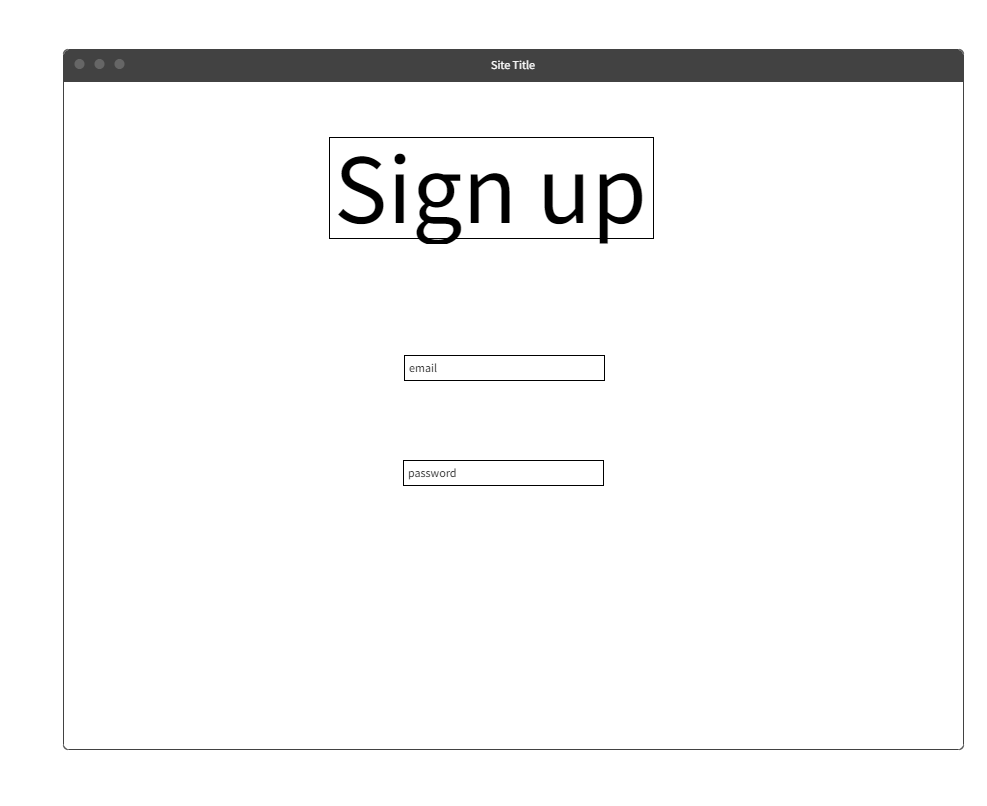
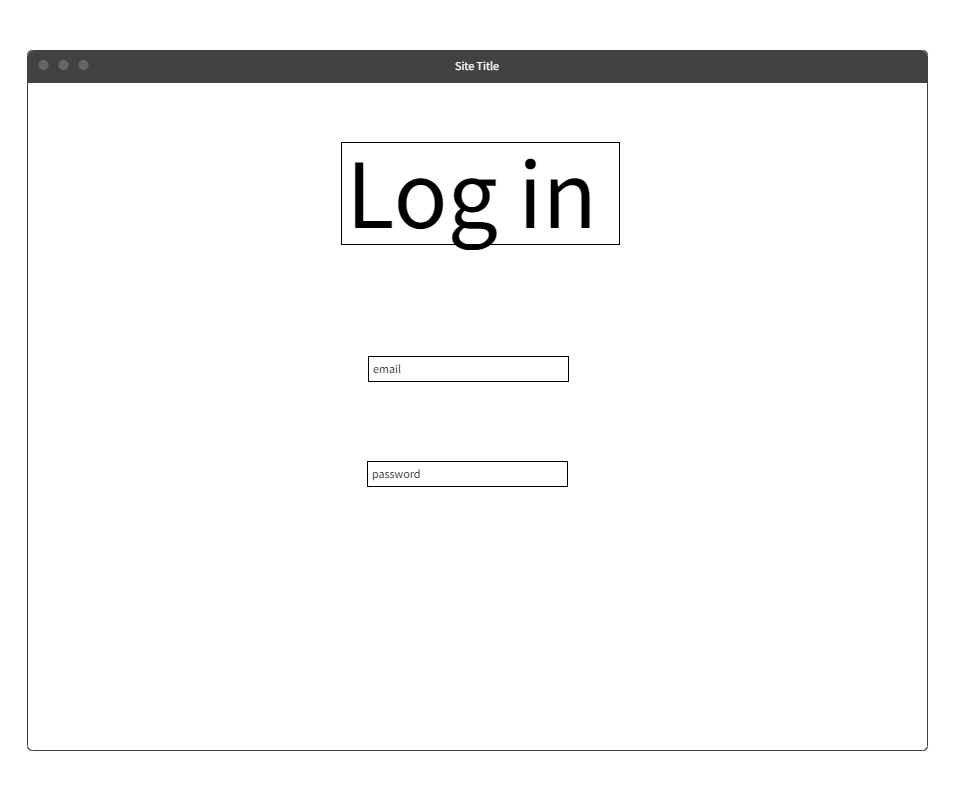
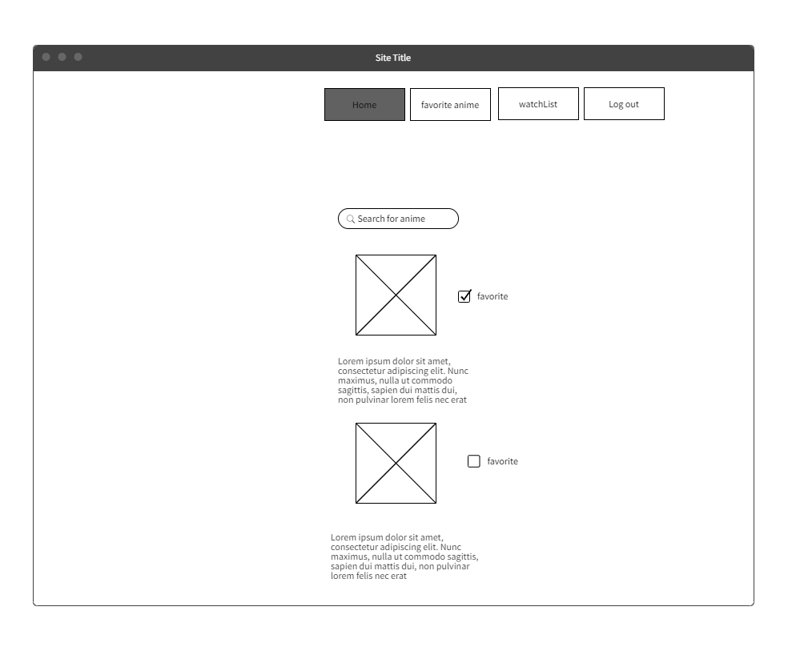
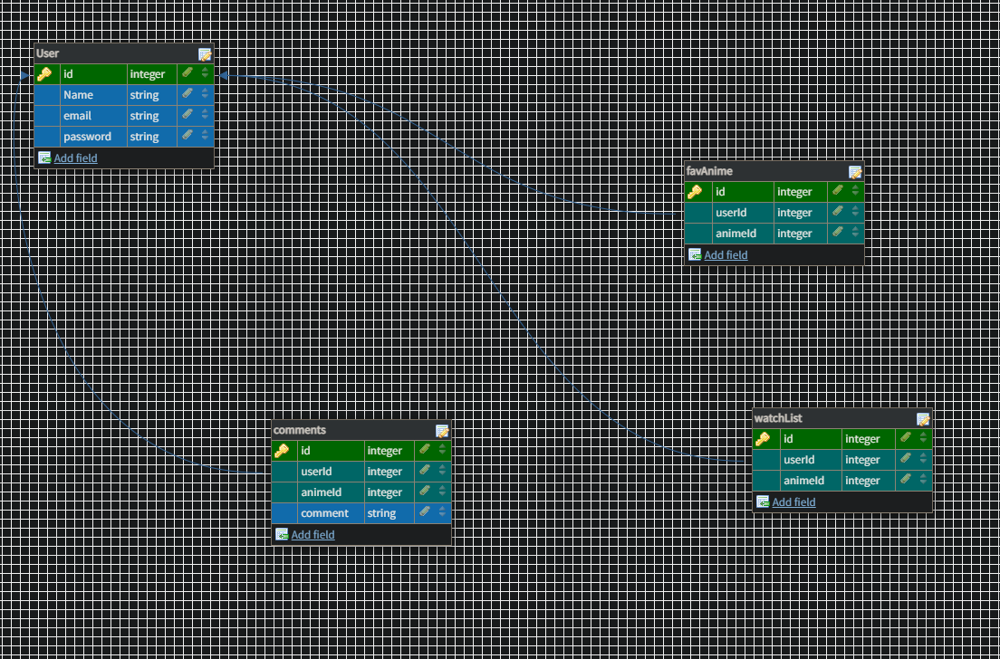
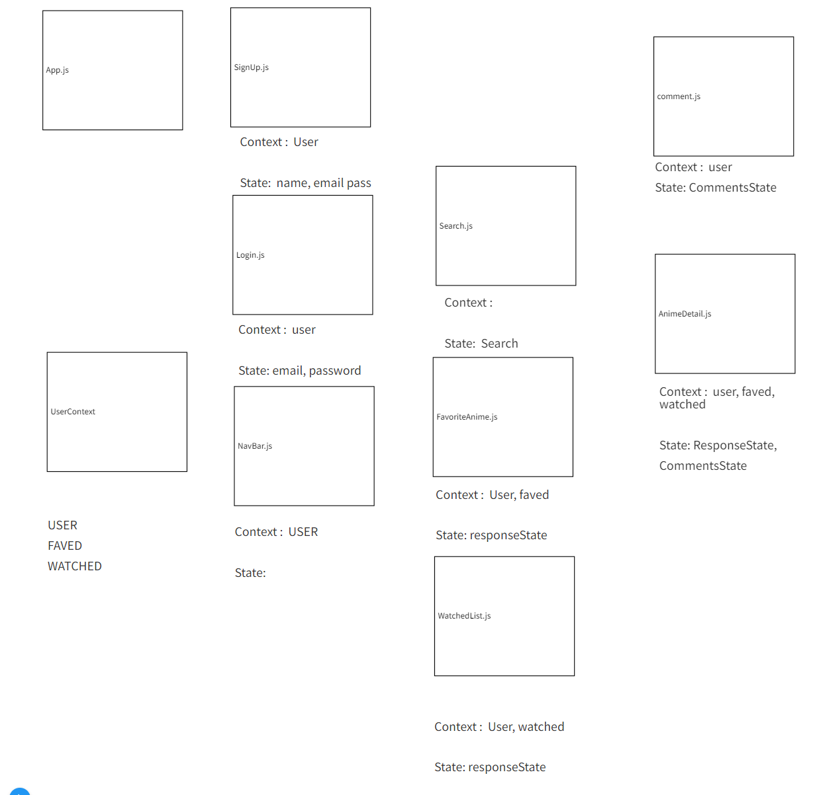

# Anime-Api-Search

## Overview

This projects is about making an website that allows users to search they're favorite anime. The website would let the user register and login to their own account. Once login to their account, the user would be able to favorite their anime and write a review about the anime too. They are also able to see all the information about said anime including episodes etc. 

---

## Wireframe
 

---

## ERD

---

## Component Tree

---

## MVP

:white_medium_small_square: Create a function to handle the submit of login and sign up

:white_medium_small_square: Have a backEnd for a user, favoriteAnime, WatchedAnime, and comments and also 

:white_medium_small_square: Create a function for the submit of the search of the anime

:white_medium_small_square: Display all the details of the show from what user searched 

:white_medium_small_square: Displays if the user watched or didn't watch a show with a toggle with a turnery, if user did, create a function that handles a toggle for the favorite too. both will be posted on backend

:white_medium_small_square: create a favorited page and a watched page where it shows what the user watched 

---

## Routes 
| PATH | ROUTE | Description |
| --- | --- | --- |
| /user | POST | Signup/Create user |
| /user/login | POST | Login user |
| /user/:id | DELETE | delete user |
| /user | GET | Verify user |
| /favAnime | GET | Pull all favorite anime from user |
| /favAnime | POST | adds anime to user favorites |
| /favAnime/:id | DELETE | deletes anime to user favorites |
| /watchList | GET | Pull all watchList from user |
| /watchList | POST | adds watchList to user |
| /watchList/:id | DELETE | deletes watchList to user |
| /comment | POST | Add to cart |
| /comment/:id | DELETE | Remove from cart |

---

## Core Goals 

:one:&nbsp; When I first visit the site, I'm on a home page that just has a simple welcome message.

:two:&nbsp; When not logged in, I see links to home, signup & login only. If I were to visit any of these routes manually while logged in, I would get redirected to the home page.

:three:&nbsp; I can create an account, log in, and log out.

:four:&nbsp; When logged in, I see links to home, logout, favoriteAnime, WatchList. If I were to visit any of these routes manually while logged out, I would get redirected to the home page.

:five:&nbsp; The user can search for a specific anime. Clicking on any anime takes me to its details page.

:six:&nbsp; The animeApi is called Jikan and gets anime thorough search

:seven:&nbsp; next to each anime there will be a toggle to see if you watched the movie, if movie was watched, you have an option of favoring the movie

:eight:&nbsp; the watch list will show a list of all the anime you've watched and fav will be the same thing

---

## Strech Goals

:one:&nbsp; A page where there's a multiple logos and a user can add a favorite logo and that favorite logo can have multiple functions

:two:&nbsp; Add comments to anime posts

